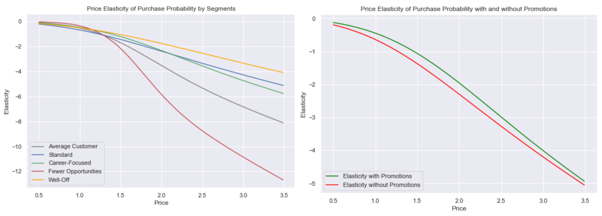

# Purchase Prediction
Predicting Customer Transactions and Calculating Price Elasticities by Segment

## Installation
- Python 3.7.3
- Libraries: pandas, NumPy, Matplotlib, Seaborn, scikit-learn

## File Descriptions
Dataset and its legend can be found in [`data`](https://github.com/k-bosko/purchase_analytics/tree/master/data) folder.

[`pickle`](https://github.com/k-bosko/purchase_analytics/tree/master/pickle) folder contains the results of customer segmentation (StandardScaler, PCA, KMeans).

The analysis can be found as Jupyter Notebook here:

* [purchase_prediction_model.ipynb](https://github.com/k-bosko/purchase_prediction/blob/master/purchase_prediction_model.ipynb)

## Project Description
In this project, I analyzed purchase behavior of 500 customers that bought 5 different brands of chocolate candy bars in a physical FMCG store during 2 years. In total, they made 58,693 transactions, captured through the loyalty cards they used at checkout. 

Based on the results of customer segmentation, I answered the following business questions:
- Will a customer buy a product from a particular product category when they enter the shop?
- How does demand for the product change with the given change in price?

To answer these questions, I first built a statistical model using Logistic Regression that estimates purchase probability for each customer at each shopping trip. Then I calculated price elasticity of purchase probability with/without promotions and for different segments.

## Results

Fewer Opportunities segment is the most price sensitive compared to other segments. The price elasticity cruve for Fewer Opportunities goes steep downwards, meaning that with increase in price, customers of this segment become more elastic much faster. The tipping point between elasticity and inelasticity for Fewer Opportunities segment is 1.27 USD.

There is no much support for the original hypothesis that Career Focused group might endure higher prices. It turned out that Well-Off segment is less elastic when it comes to price increases than Career Focused segment. So we might try increasing prices for Brand 4 that is primarily bought by Well-Off segment.

According to analysis, customers are less price sensitive to price changes when there are promotional activities.
If the product has a regular price of 1.30 USD (i.e. without promotion), its purchase probability is elastic. However, if the product costs 1.50 USD and its price is reduced to 1.30 USD during promotion, the purchase probability is still inelastic at this price point.

## Acknowledgement
This project is part of "Customer Analytics" course by [365DataScience](https://365datascience.com)

However, I modified and streamlined some code, e.g. by writing functions to automatically calculate and plot price elasticities.
